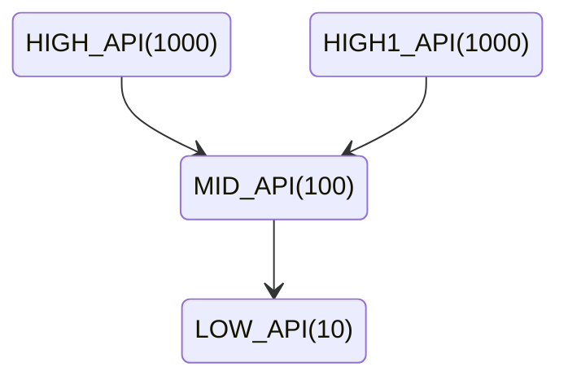
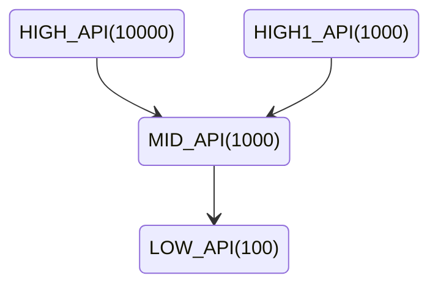

# C++ Concurrency in Action

# Managing threads

## Basic thread

`std::thread`可以使用函数和callable对象创建

<details>
  <summary>code</summary>

```cpp
#include <iostream>
#include <thread>
#include <mutex>

using namespace std;
mutex print_lock;

void hello_func()
{
    lock_guard<mutex> lg{print_lock};
    cout << "hello function: " << std::this_thread::get_id() << endl;
}

class hello_class
{
public:
    void operator()()
    {
        lock_guard<mutex> lg{print_lock};
        cout << "hello callable: " << std::this_thread::get_id() << endl;
    }
};

int main()
{
    std::thread thread_func(hello_func);
    hello_class c;
    std::thread thread_class(c);
    std::thread thread_lambda([] {
        lock_guard<mutex> lg{print_lock};
        cout << "hello lambda: " << std::this_thread::get_id() << endl;
    });
    {
        lock_guard<mutex> lg{print_lock};
        cout << "main: " << std::this_thread::get_id() << endl;
    }
    thread_func.join();
    thread_class.join();
    thread_lambda.join();
    return 0;
}
```

</details>

使用`detach`分离线程和当前线程, 使用`join`等待线程完成, 如果在调用`join`时线程是非`joinable`的就会出现异常, 首先要判断是否`joinable`

**RAII(Resource Acquisition Is Initialization)**方式管理线程

C++构造函数获取资源, 析构函数释放资源, 利用C++对象必定会析构的特征

<details>
  <summary>code</summary>

```cpp
#include <thread>
#include <chrono>
#include <iostream>

//using namespace std;
using namespace std::chrono_literals;

class thread_guard
{
    std::thread &t;
public:
    explicit thread_guard(std::thread &t_) : t(t_) {}
    ~thread_guard() {
        if (t.joinable()) {
            t.join();
        }
    }
    thread_guard(thread_guard const &) = delete;
    thread_guard &operator=(thread_guard const &)=delete;
};

void func(int n) {
    for (int i = 0; i < n; ++i) {
        std::this_thread::sleep_for(1s);
        std::cout << "sleep for 1s" << std::endl;
    }
}

int main()
{
    std::thread t1(func, 3);
    thread_guard guard(t1);
    return 0;
}
```

</details>

`std::thread`对象在`detach`后就进入后台运行, 没有任何手段获取该对象的引用, 也不能`join`, 该对象从此由C++ Runtime Library管理. 在Unix中分离的线程成为*daemon threads*, 同样的进程称为*daemon process*, 代表在后台运行没有显示的用户界面. 通常这种后台线程用于监视文件系统, 清理缓存中无用的记录, 优化数据结构. 同时也用于验证在fire and forget(收发隔离系统)任务中

只有在`joinable()`为真时才能`detach()`

例子:

<details>
  <summary>code</summary>

```cpp
void edit_document(std::string const& filename)
{
	open_document_and_display_gui(filename);
	while(!done_editing())
	{
		user_command cmd=get_user_input();
		if(cmd.type==open_new_document)
		{
			std::string const new_name=get_filename_from_user();
			std::thread t(edit_document,new_name);
			t.detach();
		}
		else
		{
			process_user_input(cmd);
		}
	}
}
```
</details>

在新建文件时创建新的线程, 后台处理文本编辑命令, command pattern

## Passing arguments to a thread function

传入线程的参数是引用和指针时要考虑变量的生存周期, 但有时候线程需要更新数据就要传输引用进去

就算函数声明的是引用, 在构造线程传参时依旧会变成拷贝, 例子:

<details>
  <summary>code</summary>

```cpp
#include <thread>
#include <string>
#include <iostream>

using namespace std;

struct people
{
    int age;
    string name;
};

void happy_birthday(people &p)
{
    cout  << p.name << " is " << p.age++
    << " years old, next year will be " << p.age << endl;
}

int main()
{
    people p{18, "Bob"};
    std::thread t(happy_birthday, p);
    t.join();
    cout << "age :" << p.age << endl;
}

//结果
Bob is 18 years old, next year will be 19
age :18
```

</details>

## Transferring ownership of a thread

**传递引用**

<mark>为了传引用必须使用`std::ref(p)`才能成功</mark>

**绑定成员函数**

```cpp
struct cat
{ void sleep() {}; }
cat c;
std::thread t(&cat::sleep, &c);
```

第一个参数是类的指针

**传递右值(变量转移)**

```cpp
void process_big_object(std::unique_ptr<big_object>);
std::unique_ptr<big_object> p(new big_object);
p->prepare_data(42);
std::thread t(process_big_object,std::move(p));
```

thread是moveable的, unique_ptr, 和ifstream也是, 可以用std::move, 可以用thread::move

<details>
  <summary>code</summary>

```cpp
#include <thread>
#include <iostream>
#include <chrono>

using namespace std;
using namespace std::chrono_literals;

void some_function1()
{
    for (int i = 0; i < 100; ++i) {
        this_thread::sleep_for(1s);
        cout << "func 1, this id: " << this_thread::get_id() << endl;
    }
}

void some_function2()
{
    for (int i = 0; i < 100; ++i) {
        this_thread::sleep_for(1s);
        cout << "func 2, this id: " << this_thread::get_id() << endl;
    }
}

int main()
{
    thread t1(some_function1);
    this_thread::sleep_for(3s);
    thread t2 = std::move(t1);
    this_thread::sleep_for(3s);
    t1 = thread(some_function2);
    this_thread::sleep_for(3s);
    thread t3 = std::move(t2);
    this_thread::sleep_for(3s);
    t1 = std::move(t3);     // std::terminate()会发生
}
```

</details>

在已经运行函数的线程中用另外一个线程赋值会崩溃, move线程不会改变线程id

## Choosing the number of threads at runtime

使用`std::thread::hardware_concurrency()`可以得到cpu并发能力

`std::accumulate`累加算法, `std::distance`迭代器直接的距离

## Identifying threads

使用`std::thread::id`来标识线程, 对于当前线程使用`std::this_thread::get_id()`

## Sharing data between threads

涉及线程间共享数据, 用锁保护数据, 其他保护共享数据的方法

## Problems with sharing data between threads

双向链表的移除, 先修改两边的指针, 然后再删除, 然而修改指针分两步, 左边和右边, 与此同时如果线程进行读取将会出问题

解决办法有两种:

- 采用数据结构保护机制
- 采用无锁编程, memory model需要设计
- 采用STM(software transactional memory), 参考[事务内存](https://zhuanlan.zhihu.com/p/151425608)

## Protecting shared data with mutexes

不推荐直接使用`std::mutex`, 而是使用`std::lock_guard`

可以把mutex写在结构体里面, 但是要确定结构体里面的正确的数据被保护起来了

原则: **不要在mutex保护范围外传递被保护数据的引用和指针, 或者通过函数返回, 或者在可见的额外内存存储, 或者把他们当变量传递给其他用户提供的函数**

设计接口问题:

对于总体需要进行保护的数据, 比如双向链表, 单保护被删除的对象不行, 其左右两边的对象也需要加锁;

对于类似stack这种数据, 其`empty()`,`top()`和`size()`方法虽然调用的时候是正确的, 但是在实际使用的时候, 一旦返回完这两个函数的结果, 另一个线程对数据进行改变, 那么这两个结果可能就失去了正确性, 就算在数据结构内部增加mutex防止读写问题也没用

对于大量数据的操作, 比如`stack<vector<int>>`, 如果stack在pop的时候由于申请新的内存失败, 然后没能把数据拷贝出去就删除了数据, 那么就会造成数据的永久丢失, 所以stack的接口设计了`top`和`pop`, 把数据拷贝和数据删除分开, 防止出现该问题

解决方案1:

传递一个引用到pop里面去, 确保内存申请操作在pop函数里面得到确认

```cpp
std::vector<int> result;
some_stack.pop(result);
```

缺点是需要额外的构造变量, 而且有些对象没有默认构造只有拷贝构造或者构造的时候就初始化, 不支持默认构造

解决方案2:

使用移动构造, 或者无异常构造, 缺点就是有些用户定义的对象不可避免在构造函数抛出异常

解决方案3:

返回被`pop`的对象的指针, 缺点就是对于int这种数据返回指针不划算, 同时返回的指针容易产生内存泄露, 也可以用共享指针来管理内存

实现代码:

<details>
  <summary>code</summary>

```cpp
class empty_stack : public std::exception
{
public:
    empty_stack() noexcept
            : exception("empty stack", 1)
    {}
};

template<typename T>
class threadsafe_stack
{
private:
    std::stack<T> data;
    mutable std::mutex m;
public:
    threadsafe_stack() = default;

    threadsafe_stack(const threadsafe_stack &other)
    {
        std::lock_guard<std::mutex> lock(other.m);
        data = other.data;
    }

    void push(T new_value)
    {
        std::lock_guard<std::mutex> lock(m);
        data.push(new_value);
    }

    std::shared_ptr<T> pop()
    {
        std::lock_guard<std::mutex> lock(m);
        if (data.empty()) throw empty_stack();
        std::shared_ptr<T> const res(std::make_shared<T>(data.top()));
        data.pop();
        return res;
    }

    void pop(T &value)
    {
        std::lock_guard<std::mutex> lock(m);
        if (data.empty()) throw empty_stack();
        value = data.top();
        data.pop();
    }

    bool empty()
    {
        std::lock_guard<std::mutex> lock(m);
        return data.empty();
    }
};
```

</details>

fine-grained locking scheme: 细粒度锁方案

如果采用细粒度锁会增加复杂度, 而且多个锁会有可能造成**死锁**

死锁的解决办法是每次都按照相同的顺序给两个mutex上锁, C++标准库中有`std::lock`可以同时对两个锁加锁而不会产生死锁

<details>
  <summary>code</summary>

```cpp
class some_big_object;
void swap(some_big_object &lhs, some_big_object &rhs);

class X
{
private:
    some_big_object some_details;
    std::mutex m;
public:
    X(some_big_object const &d) : some_detail(sd) {}
    friend void swap(X &lhs, X&rhs)
    {
        if (&lhs == &rhs) return;
        std::lock (lhs.m, rhs.m);
        std::lock_guard<std::mutex> lock_a(lhs.m, std::adopt_lock);
        std::lock_guard<std::mutex> lock_b(rhs.m, std::adopt_lock);
        swap(lhs.some_detail, rhs.some_detail);
    }
};
```

</details>

函数`std::adopt_lock`的含义是表示构造函数第一个参数中的锁已经锁上了, 再声明`std::lock_guard`则是程序结束后释放锁

死锁问题还存在于两个线程互相调用`join`, 都在等待对方执行完毕, 所以在对方线程有几率等待己方线程时不要等待对方线程

TIPS:

**AVOID NESTED LOCKS(避免嵌套锁)**

在已经保持了一个锁之后不要再请求一个锁

**AVOID CALLING USER-SUPPLIED CODE WHILE HOLDING A LOCK(有锁时避免调用用户提供的代码)**

由于不知道用户代码会做什么, 很可能导致死锁, 不要传闭包或者函数指针进去

**ACQUIRE LOCKS IN A FIXED ORDER(以固定顺序获取锁)**

对于两个锁或者多个锁, 每个线程中以固定顺序获取可以防止死锁

对于类似链表这种数据结构, 考虑每个节点上锁, 以逐节向上锁定的方式可以允许多线程访问链表, 但是必须以相同的顺序访问, 先获取后一个的锁然后释放前一个的锁, 对于删除则需要获取删除元素和删除元素两边的锁, 同样需要按照顺序锁定三个元素, 需要定义**遍历顺序**

**USE A LOCK HIERARCHY(使用锁层次)**

将应用程序分层, 并确认所有能够在任意层级被上锁的互斥元

<details>
  <summary>code</summary>

```cpp
#include <mutex>

class hierarchical_mutex
{
    std::mutex internal_mutex;
    unsigned long const hierarchy_value;
    unsigned long previous_hierarchy_value;
    static thread_local unsigned long this_thread_hierarchy_value;

    void check_for_heirarchy_violation() const
    {
        if (this_thread_hierarchy_value <= hierarchy_value) {
            throw std::logic_error("mutex hierarchy violated");
        }
    }

    void update_hierarchy_value()
    {
        previous_hierarchy_value = this_thread_hierarchy_value;
        this_thread_hierarchy_value = hierarchy_value;
    }

public:
    explicit hierarchical_mutex(unsigned long value) : hierarchy_value(value), previous_hierarchy_value(0)
    {}

    void lock()
    {
        check_for_heirarchy_violation();
        internal_mutex.lock();
        update_hierarchy_value();
    }

    void unlock()
    {
        this_thread_hierarchy_value = previous_hierarchy_value;
        internal_mutex.unlock();
    }

    bool try_lock()
    {
        check_for_heirarchy_violation();
        if (!internal_mutex.try_lock())
            return false;
        update_hierarchy_value();
        return true;
    }
};

// thread_local表示每个线程都会有一个该变量的副本
thread_local unsigned long hierarchical_mutex::this_thread_hierarchy_value(ULONG_MAX);

hierarchical_mutex high_level_mutex(10000);
hierarchical_mutex low_level_mutex(5000);

int do_low_level_stuff();

int low_level_func()
{
    std::lock_guard<hierarchical_mutex> lk(low_level_mutex);
    return do_low_level_stuff();
}

void high_level_stuff(int some_param);

void high_level_func()
{
    std::lock_guard<hierarchical_mutex> lk(high_level_mutex);
    high_level_stuff(low_level_func());
}

void thread_a()
{
    high_level_func();
}

hierarchical_mutex other_mutex(100);
void do_other_stuff();

void other_stuff()
{
    high_level_func();
    do_other_stuff();
}

void thread_b()
{
    std::lock_guard<hierarchical_mutex> lk(other_mutex);
    other_stuff();
}
```

</details>

线程a遵守规则, b不遵守. a先调用高层次API, 然后锁定了高层次锁, 给自己设置了高层次值(10000), 才能通过低层次的锁的验证, 从而获取低层次的锁; 而b先锁住了低层次的锁(100), 转而调用高层次API, 由于层次值低于(10000)被判定不能获取锁

层次锁的好处就是从上至下设置好层次值后, 通过多高的层次值调用会依次给下层设置更高的层次值从而锁定, 比如:



在`this_thread_hierarchy_value`为10000初始值下, 从上至下调用后锁变为



从而能够防止其他API比如HIGH1_API来调用MID_API, 退出后值又会返回原来的值

**EXTENDING THESE GUIDELINES BEYOND LOCKS(把这些原则扩展到锁以为的地方去)**

死锁不光会在有锁的地方发生, 也可能发生在循环等待(互相等待)中

使用std::unique_lock

在`std::unique_lock`的第二个参数可以传入`std::defer_lock`和`std::adopt_lock`, 前者必须要求`std::lock_guard`在构造时锁没锁上

```cpp
unique_lock(_Mutex& _Mtx, adopt_lock_t)
        : _Pmtx(_STD addressof(_Mtx)), _Owns(true) {} // construct and assume already locked

unique_lock(_Mutex& _Mtx, defer_lock_t) noexcept
        : _Pmtx(_STD addressof(_Mtx)), _Owns(false) {} // construct but don't lock
```


<details>
  <summary>code</summary>

```cpp
#include <mutex>

class some_big_object {};
void swap(some_big_object &lhs, some_big_object &rhs);
class X
{
private:
    some_big_object some_detail;
    std::mutex m;
public:
    X(some_big_object const &sd) : some_detail(sd) {}
    friend void swap(X &lhs, X &rhs) {
        if (&lhs == &rhs)
            return;
        std::unique_lock<std::mutex> lock_a(lhs.m, std::defer_lock);
        std::unique_lock<std::mutex> lock_b(rhs.m, std::defer_lock);
        std::lock(lock_a, lock_b);
        swap(lhs.some_detail, rhs.some_detail);
    }
};
```

</details>

`std::unique_lock`可移动不可复制, 允许函数返回`std::unique_lock`给调用者

`std::unique_lock`支持手动`unlock`而不需要等到析构, 可以提升应用程序性能, 而`std::lock_guard`仅在作用域范围内生效, 可以把`std::unique_lock`看作类似`std::unique_ptr`类似的功能

锁粒度在恰当的粒度

如果可能, 仅在实际访问共享数据的时候锁定互斥元, 尝试在锁的外面做任意数据处理, 否则由于多个线程同时等待同一个互斥元会耗费大量的时间

```cpp
void get_and_process_data()
{
    std::unique_lock<std::mutex> lk(mutex);
    data d = get_next_data();
    lk.unlock();	//解锁
    result r = process(d);
    lk.lock();		//重新上锁
    write_result(r);
}
```


在持有锁时, 避免诸如文件I/O等操作

**一般情况下, 只应该以执行要求的操作所需的最小可能时间而去持有锁**

反例:

<details>
  <summary>code</summary>

```cpp
class Y
{
private:
    int some_detail;
    mutable std::mutex m;

    int get_detail() const
    {
        std::lock_guard<std::mutex> lk(m);
        return some_detail;
    }

public:
    explicit Y(int sd) : some_detail(sd)
    {}

    friend bool operator==(Y const &lhs, Y const &rhs)
    {
        if (&lhs == &rhs) return true;
        int const lhs_value = lhs.get_detail();
        int const rhs_value = rhs.get_detail();
        return lhs == rhs;
    }
};
```

</details>

在这段代码中, 当比较的结果返回时, 由于细粒度锁, 可能此时lhs的值已经改变了, 返回的结果也不是正确的, 这要看对当前比较函数的定义

## Alternative facilities for protecting shared data

考察那种只有在初始化时才需要进行保护以后都是只读的数据

lazy initialization

```cpp
std::shared_ptr<some_resource> resource_ptr;
void foo()
{
    if (!resource_ptr) {
        resource_ptr = std::make_shared<some_resource>();
    }
    resource_ptr->do_something();
}
```

通常的做法:

```cpp
std::shared_ptr<some_resource> resource_ptr;
std::mutex resource_mutex;
void foo()
{
    std::unique_lock<std::mutex> lk(resource_mutex);
    if (!resource_ptr) {
        resource_ptr = std::make_shared<some_resource>();
    }
    lk.unlock();
    resource_ptr->do_something();
}
```

如果改成:

```cpp
std::shared_ptr<some_resource> resource_ptr;
std::mutex resource_mutex;
void foo()
{
    if (!resource_ptr) {
        std::unique_lock<std::mutex> lk(resource_mutex);
        if (!resource_ptr) {
            resource_ptr = std::make_shared<some_resource>();
        }
    }
    resource_ptr->do_something();
}
```

这种做法会导致数据竞争, 锁的外部调用resource_ptr和锁内部进行写入不同步

标准C++库提供`std::call_once`保证函数只会调用一次

<details>
  <summary>code</summary>

```cpp
#include <iostream>
#include <thread>
#include <mutex>

std::once_flag flag1, flag2;

void simple_do_once()
{
    std::call_once(flag1, []() {
        std::cout << "Simple example: called once: "
                  << std::this_thread::get_id() << std::endl;
    });
}

void may_throw_function(bool do_throw)
{
    if (do_throw) {
        std::cout << "throw: call_once will retry\n"; // this may appear more than once
        throw std::exception();
    }
    std::cout << "Didn't throw, call_once will not attempt again\n"; // guaranteed once
}

void do_once(bool do_throw)
{
    try {
        std::call_once(flag2, may_throw_function, do_throw);
    }
    catch (...) {
    }
}

int main()
{
    std::thread st1(simple_do_once);
    std::thread st2(simple_do_once);
    std::thread st3(simple_do_once);
    std::thread st4(simple_do_once);
    st1.join();
    st2.join();
    st3.join();
    st4.join();

    std::thread t1(do_once, true);
    std::thread t2(do_once, true);
    std::thread t3(do_once, false);
    std::thread t4(do_once, true);
    t1.join();
    t2.join();
    t3.join();
    t4.join();
}
```

结果

```
Simple example: called once: 13464
throw: call_once will retry
throw: call_once will retry
throw: call_once will retry
Didn't throw, call_once will not attempt again
```

</details>

`std::call_once`很容易用于类成员延迟初始化

静态变量也可以避免初始化的竞争

```cpp
class my_class;
my_class &get_instance()
{
    static my_class instance;
    return instance;
}
```

读写锁, 多个可以同时读取, 但是写入和读取互斥, 多个同时写入也是互斥

`std::shared_mutex`C++17标准加入, 之前在boost里面, `std::shared_mutex`用`std::shared_lock`去锁可以做到多个读取不会互相竞争, 而写用`std::lock_guard`和读取竞争即可

<details>
  <summary>code</summary>

```cpp
#include <thread>
#include <shared_mutex>
#include <chrono>
#include <iostream>

using namespace std::chrono_literals;

std::shared_mutex count_mutex;
int count = 0;

void increase_count()
{
    std::lock_guard<std::shared_mutex> lk(count_mutex);
    count +=1;
}

int get_count(std::chrono::duration<long long int, std::ratio<1>> sec)
{
    std::shared_lock<std::shared_mutex> lk(count_mutex);
    std::this_thread::sleep_for(sec);
    return count;
}

void increase_thread(int c)
{
    for (int i = 0; i < c; ++i) {
        increase_count();
        std::this_thread::sleep_for(2.2s);
        std::cout << "thread " << std::this_thread::get_id() << " increase" << std::endl;
    }
}

void get_thread(int c)
{
    for (int i = 0; i < c; ++i) {
        int n = get_count(1s);
        std::cout << "thread " << std::this_thread::get_id() << " get " << n << std::endl;
    }
}


int main()
{
    std::thread t1(increase_thread, 10);
    std::thread t2(get_thread, 10);
    std::thread t3(get_thread, 10);
    t1.join();
    t2.join();
    t3.join();
    return 0;
}
```

</details>

递归锁`std::recursive_mutex`, 可以在一个线程里面多次锁, 但是也要多次释放, 可以用`std::lock_guard`进行处理

# Synchronizing concurrent operations

任务同步, 条件变量(condition variables), 期值(future)

## Waiting for an event or other condition

等待任务完成

1. 不断查询状态
2. 每次查询状态进行延时
3. 采用条件变量

条件变量`std::condition_variable`和`std::condition_variable_any`

<details>
  <summary>code</summary>

```cpp
#include<mutex>
#include<queue>

struct data_chunk
{
};

std::mutex mut;
std::queue<data_chunk> data_queue;
std::condition_variable data_cond;

bool more_data_to_prepare()
{ return true; }

data_chunk prepare_data()
{ return {}; }

void process(data_chunk &data)
{}

bool is_last_chunk()
{ return false; }

void data_preparation_thread()
{
    while (!more_data_to_prepare()) {
        data_chunk const data = prepare_data();
        std::lock_guard<std::mutex> lk(mut);
        data_queue.push(data);
        data_cond.notify_one();
    }
}

void data_processing_thread()
{
    while (true) {
        std::unique_lock<std::mutex> lk(mut);
        data_cond.wait(lk, [] { return !data_queue.empty(); });
        data_chunk data = data_queue.front();
        data_queue.pop();
        lk.unlock();
        process(data);
        if (is_last_chunk())
            break;
    }
}
```

</details>

```cpp
template< class Predicate >
void wait( std::unique_lock<std::mutex>& lock, Predicate pred )
```

等价于

```cpp
while (!pred()) {
    wait(lock);
}
```

安全队列

<details>
  <summary>code</summary>

```cpp
#include <memory>
#include <queue>
#include <condition_variable>

class data_chunk {};

template<typename T>
class threadsafe_queue
{
private:
    mutable std::mutex mut;
    std::queue<T> data_queue;
    std::condition_variable data_cond;
public:
    threadsafe_queue() = default;
    threadsafe_queue(const threadsafe_queue &other)
    {
        std::lock_guard<std::mutex> lk(mut);
        data_queue = other.data_queue;
    }
    threadsafe_queue &operator=(const threadsafe_queue &) = delete;

    void push(T new_value)
    {
        std::lock_guard<std::mutex> lk(mut);
        data_queue.push(new_value);
        data_cond.notify_one();
    }

    bool try_pop(T &value)
    {
        std::lock_guard<std::mutex> lk(mut);
        if (data_queue.empty()) {
            return false;
        }
        value = data_queue.front();
        data_queue.pop();
        return true;
    }
    std::shared_ptr<T> try_pop()
    {
        std::lock_guard<std::mutex> lk(mut);
        if (data_queue.empty()) {
            return std::shared_ptr<T>();
        }
        std::shared_ptr<T> res(std::make_shared<T>(data_queue.front()));
        return res;
    }

    void wait_and_pop(T &value)
    {
        std::unique_lock<std::mutex> lk(mut);
        data_cond.wait(lk, [this] { return !data_queue.empty();});
        value = data_queue.front();
        data_queue.pop();
    }

    std::shared_ptr<T> wait_and_pop()
    {
        std::unique_lock<std::mutex> lk(mut);
        data_cond.wait(lk, [this] { return !data_queue.empty(); });
        std::shared_ptr<T> res(std::make_shared<T>(data_queue.front()));
        return res;
    }

    bool empty() const
    {
        std::lock_guard<std::mutex> lk(mut);
        return data_queue.empty();
    }
};
```

</details>

## Waiting for one-off events with futures

使用future等待一次性事件

