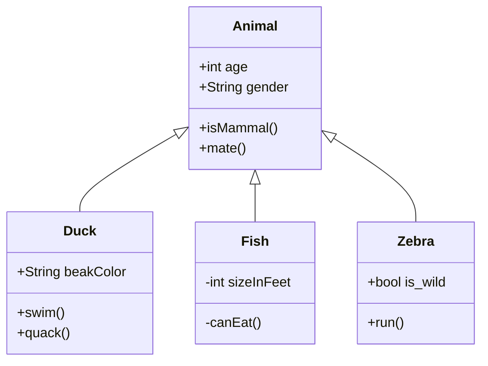
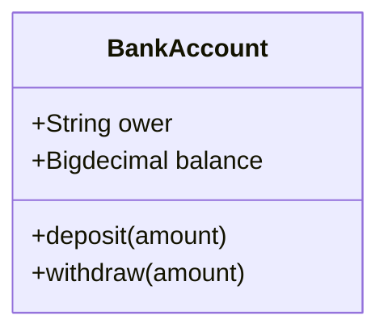
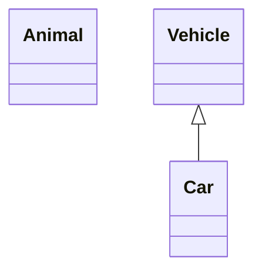
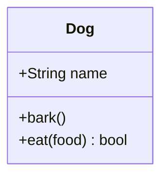
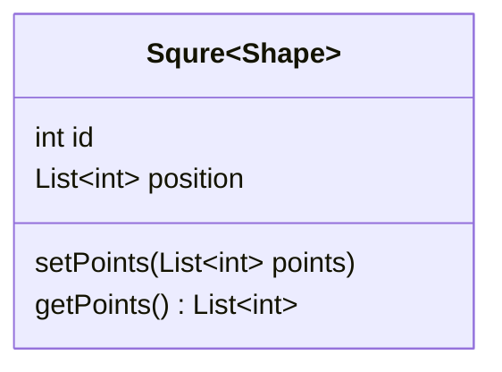
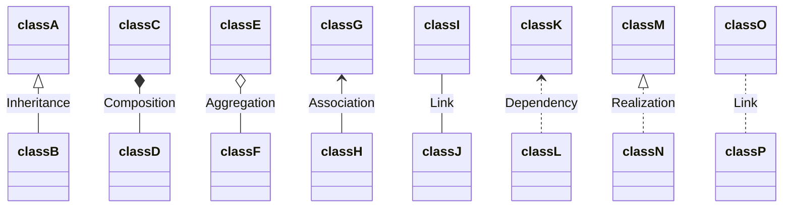
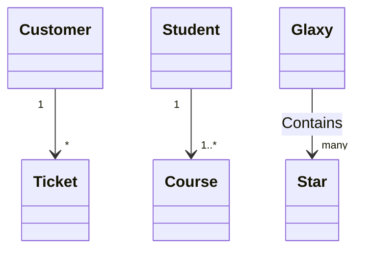
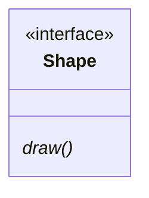
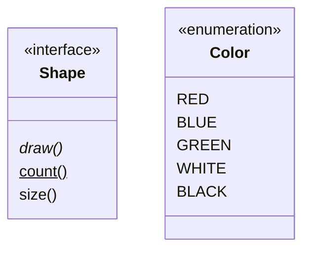

# Mermaid类图

原文 [Class Diagram](https://mermaid-js.github.io/mermaid/#/classDiagram)

类图用于面向对象对于应用结构概念建模, 也用于把具体的模型翻译成程序代码. 类图也可以用于数据建模

mermaid渲染:



## 语法

### 类结构

顶部代表类名称, 中部代表类成员变量, 底部代表类成员函数

```
classDiagram
class BankAccount {
    +String ower
    +Bigdecimal balance
    +deposit(amount)
    +withdraw(amount)
}
```





## 定义类

- 显示声明: `class Animal`
- 通过关系声明 `Vehicle <|-- Car`

```
classDiagram
class Animal
Vehicle <|-- Car
```




## 定义类的成员

包括了属性和方法, 还有额外信息

区分方法和属性的决定性符号是`()`, 定义类成员有两种办法

- 类外定义

```
classDiagram
class Dog
Dog : +String name
Dog : +bark()
Dog : +eat(food) bool
```



- 类内部定义, 用大括号

```
classDiagram
class Dog {
    +String name
    +bark()
    +eat(food) bool
}
```


## 返回值

返回值在右括号后面添加

## 泛型类型

泛型用`~`代替两个尖括号

```
classDiagram
class Squre~Shape~{
    int id
    List~int~ position
    setPoints(List~int~ points)
    getPoints() List~int~
}
```




## 可见性

类成员的可见性有四种:

- `+` public
- `-` private
- `#` protected
- `~` package/internal

还有静态和虚函数

- `*` abstract: `someAbstractMethod()*`
- `$` static: `someStaticMethod()$`

## 定义关系

主要语法:

```
[classA][Arrow][ClassB]:LabelText
```

不同箭头代表的意思:

| 类型   | 描述              |
| ------ | ----------------- |
| `<|--` | (Inheritance)继承 |
| `*--`  | (Composition)组合 |
| `o--`  | (Aggregation)聚合 |
| `-->`  | (Association)关联 |
| `--`   | (Link)实线连接    |
| `..>`  | (Dependency)依赖  |
| `..|>` | (Realization)实现 |
| `..`   | (Link)虚线连接    |

```
classDiagram
classA <|-- classB : Inheritance
classC *-- classD : Composition
classE o-- classF : Aggregation
classG <-- classH : Association
classI -- classJ : Link
classK <.. classL : Dependency
classM <|.. classN : Realization
classO .. classP : Link
```



把箭头反向也可以用

## 多重和乘数关系

一般用在Link关系上, 表示类间的关系

- `1` 只有1个
- `0..1` 0个或1个
- `1..*` 1个或多个
- `*` 多个
- `n` n个{n>1}
- `0..n` 0~n {n>1}
- `1..n` 1~n {n>1}

样式(也可以在引号内写自己的文本):

```
[classA] "cardinality1" [arrow] "cardinality2" [classB]:LabelText
```

```
classDiagram
Customer "1" --> "*" Ticket
Student "1" --> "1..*" Course
Glaxy --> "many" Star : Contains
```



## 类的注解

对类进行文本标识像元信息, 对性质进行清晰的指示, 例如:

- `<<interface>>` 接口类
- `<<abstract>>` 抽象类
- `<<service>>` 服务类
- `<<enumeration>>` 枚举

在单独的行声明:

```
classDiagram
class Shape{
    draw()*
}
<<interface>> Shape
```



在类内部:

```
classDiagram
class Shape{
    <<interface>>
    draw()*
    count()$
    size()
}

class Color{
    <<enumeration>>
    RED
    BLUE
    GREEN
    WHITE
    BLACK
}
```




## 注释

mermaid注释用`%%`开头

## 交互

绑定鼠标点击事件到浏览器: [Interaction](https://mermaid-js.github.io/mermaid/#/classDiagram?id=interaction)
