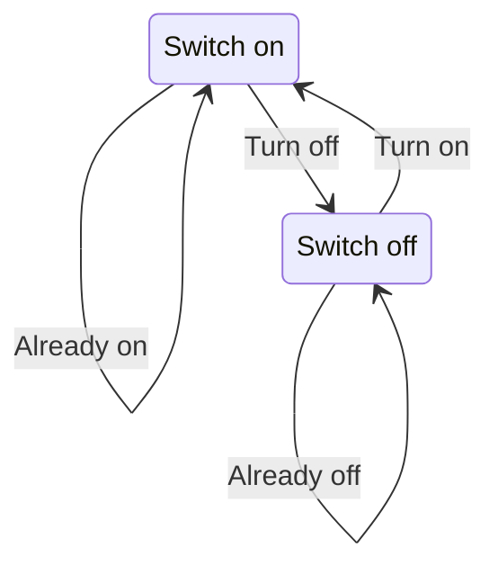
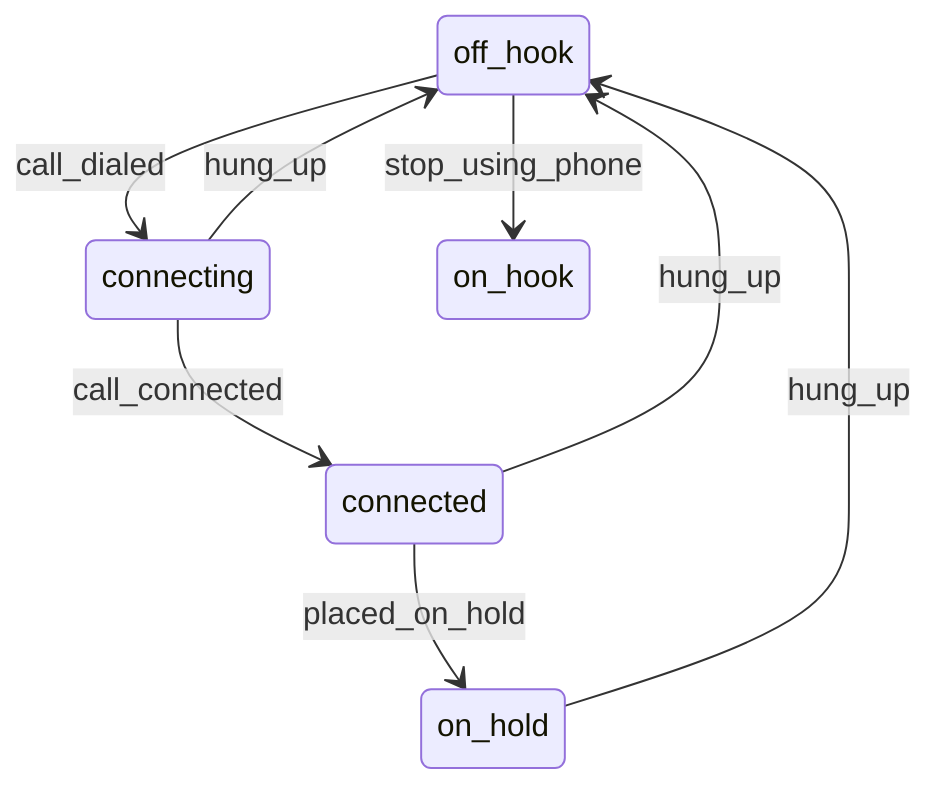

# Design Pattern

#学习/设计模式#

## SOLID Principle

- Single Responsibility Principle (SRP)
  日记例子，一个类只做一件事

- Open-Closed Principle (OCP)
  
  根据颜色大小排序, Specification类，为扩展开发，为修改关闭

- Liskov Substitution Principle (LSP)
  
  父类定义的方法意义，子类不能相违背，矩形和正方形的set_size()

- Interface Segregation Principle (ISP)
  
  打印机传真机扫描仪封为machine，不如打印，传真，扫描封为抽象功能组合

- Dependency Inversion Principle (DIP)
  
  其他类依赖本类的高级抽象而非具体实现，类间的依赖原则

## Creational Patterns

创建型模式

一些概念

- 栈分配
- 堆分配
- 智能指针

### Builder

创建模式

#### Simple Builder

HtmlBuilder

#### Fluent Builder

使用流式操作

```cpp
builder.add_child("li", "hello").add_child("li", "world");
builder->add_child("li", "hello")->add_child("li", "world");
```

为了强制让人使用Builder而不是构造函数, 可以把构造函数设为protected类型

类的隐式转换

```cpp
#include <cstdio>

class Html
{
public:
    void str()
    {
        printf("str");
    }

protected:
    Html() = default;
    friend class HtmlBuilder;
};

class HtmlBuilder
{
    Html html;

public:
    operator Html() const
    {
        return html;
    }
};

int main()
{
    HtmlBuilder builder;
    Html root = builder;
    root.str();
}
```

#### Groovy-Style Builder

Tag抽象类, 包含了所有的数据存储, 构造函数protected

P, IMG等继承, 构造函数public, 初始化一些值

总结: 通过派生类特定构造来实现多样化的对象生成

mini-DSL

#### Composite Builder

Person静态函数create()生成PersonBuilder, PersonBuilder利用.at(), .with_post_code(), .as_a()等fluent builder快速构建对象, 然后利用operator Person转化为Person对象

### Factories

工厂模式

#### Factory Method

类的方法替代构造函数创建类

Point, 笛卡尔坐标, 极坐标, 静态NewCartesian, NewPolar方法, 构造函数protected类型

#### Factory

隔离的类创建对象, 即使只是提供函数来创建类而不是直接创建

把静态NewCartesian, NewPolar方法放到PointFactory里面, Point友元类为工厂类, Point构造函数去掉

#### Inner Factory

把工厂类设置为Point的内置类, 可以访问Point私有成员而不需要友元, 然后声明一个静态的工厂类对象在Point类中

#### Abstract Factory

能被实际工厂函数继承

要创建的对象继承关系多种类复杂, 比如drink, hotdrink, tea, coffee, 工厂函数也要有相应的继承关系

**和Builder的区别, Builder是一点数据一点数据添加, Factory是一次性生成**

### Prototype

原型模式, 对象模型能够直接拷贝, 然后通过修改参数生成新的对象

#### Object Constrution

构造两个类似的对象通常需要花费更多操作, 拷贝则简单许多

#### Ordinary Duplication

直接用等于号复制, 会带来浅拷贝的问题

#### Duplication via Copy Construction

用拷贝构造函数来拷贝对象或者用=操作符拷贝对象, 或者继承自Clonable类用clone方法, 用CRTP

#### Serialization

使用Boost的Serialization, 侵入式, 非侵入式, 原理是使用序列化和反序列化来传递数据生成新的对象

#### Prototype Factory

预设几个全局的模板, 用工厂方法生成对应的

### Singleton

单例模式

#### Singleton as Global Object

静态变量返回

#### Classic Implementation

构造函数加计数器, 禁用各种构造函数, 删除拷贝构造, 赋值操作符

#### Thread Safety

加锁防止同时调用初始化函数造成问题

#### The Trouble with Singleton

单例模式写死后测试需要用假的类, 比如database, 需要改动就有很复杂的依赖, 尝试依赖单例对象的抽象接口类而不是依赖单例类

#### Singletons and Inversion of Control

使用<mark>IoC</mark>模式减少单例模式中单例对象的依赖性, 用依赖注入<mark>DI</mark>

#### Monostate

单态

是个普通的类但是表现为单例, 可以进行继承实现多态

## Structural Patterns

结构型模式

几种结构:

- Inheritance: 继承
- Composition: 包含(拥有对象)
- Aggregation: 聚集(拥有对象指针)

### Adapter

适配器模式

#### Adapter

画点函数需要画所有线的点, 包括线组成的对象, 需要把线转成点集然后绘制

#### Adapter Temporaries

上述操作每次都要进行一次转换, 消耗计算资源, 利用哈希存储转换后的数据可以只转换不存在的点

### Bridge

桥接模式

#### The Pimpl Idiom

Pimpl的好处:

- 只暴露public接口
- 修改私有类的时候由于是指针存在公有类中, 不会对公有类的二进制结构造成影响, 比如size或者函数相对偏移地址等
- 减少相互包含更多的头文件, 私有类的包含可以放到cpp文件里面去, 头文件不需要改不会让其他包含该头文件的文件重新编译

#### Bridge

Shape的自绘, Renderer的种类, Circle继承自形状, 传入Renderer引用存储

### Composite

组合模式使得用户对单个对象和组合对象的使用具有一致性

给单一的多个对象或者一组对象同一的接口, 比如begin/end, 单个的Graph对象有draw, 多个Graph组成的对象组同样有draw

ArcGIS Qt SDK里面的Geometry也是类似的设计方式, 包括了Point, Polyline, Polygon, Multipart等等

#### Array Backed Properties

Creature有一些值比如力量, 敏捷和智力, 要统计这些数据的共性, 与其定义几个不同的变量不如用数组和枚举记录在一起, 用迭代器求均值最大最小值

#### Grouping Graphic Objects

针对相同接口的对象进行编组, 用虚函数调用

#### Neural Networks

派生自模板接口

```cpp
template <typename Self>
struct SomeNeurons
{
    template <typename T> void connect_to(T& other)
    {
        for (Neuron& from : *static_cast<Self*>(this))
        {
            for (Neuron& to : other)
            {
                from.out.push_back(&to);
                to.in.push_back(&from);
            }
        }
    }
};

struct Neuron
{
    vector<Neuron*> in, out;
    unsigned int id;

    Neuron()
    {
        static int id = 1;
        this->id = id++;
    }
}

struct SingleNeuron : Neuron,
                      SomeNeurons<SingleNeuron>
{

}


struct NeuronLayer : Neuron, 
                     vector<Neuron>,
                     SomeNeurons<NeuronLayer>
{

}
```

### Decorator

装饰模式

在不改变原有类的情况下增强类的功能并且把增强的东西隔离开

实现方法:

- 动态的组合允许在运行时组合, 拥有最大的弹性
- 静态的组合对象的增强是在编译时使用模板, 所以在编译时就需要知道所有可能的增强

#### Dynamic Decorator

通过子类传入父类的引用或者指针来增加功能, 多个功能通过构造函数嵌套实现多种功能, 通过多态

```cpp
struct ColoredShape : Shape
{
    Shape& shape;
    string color;
    ColoredShape(Shape& shape, const string& color) : 
            shape{shape}, color{color} {}
};


struct TransparentShape : Shape
{
    Shape& shape;
    uint8_t transparency;
    TransparentShape(Shape& shape, uint8_t transparency) :
            shape{shape}, transparency{transparency} {}
};


// 多个功能的, 使用多态实现功能的叠加
TransparentShape s{ColoredShape{Circle{1.2}, "red"}, 100}; 
```

#### Static Decorator

使用Mixin方式继承模板类, 添加功能增强类和子类

#### Function Decorator

使用函数模板为入参, 在函数开始前和结束后进行附加操作, 增强函数的功能, 比如记录函数运行时间和运行状态的Logger类, 重载()运算符

### Façade

外观模式, 终端就是外观, 实际的内部形式是buffer,  把简单接口放在复杂的子系统前面, 比如终端很多的buffer和viewport, 最后抽象成API

### Flyweight

享元模式

(flyweight token or cookie) 通常是一个临时组件, 比如智能指针, 通常有大量相同的对象, 需要最小化使用内存存储

#### User Names

大型服务器相同名字的用户每个用户都存储一份字符串会消耗大量的字节

用int代表key, 去bitmap中查找名称, bitmap可用双向查找

#### Boost.Flyweight

boost::flyweight\<string\>直接可用变成享元

#### String Ranges

`std::string::substring()`返回的是额外的字符串空间, 而不是共享内存只改变下标的字符串

`string_view`则是共享单元

#### Naïve Approach

建立一个bool数组对应string每个字符, bool为true代表要把对应字符串大写, 这样一个字符串既存储了原始字符串也存储了大写后的字符串

vector\<bool\>是优化存储过的, 用位

#### Flyweight Implementation

格式化字符串, 用和上面一样的方式存储多个TextRange类, TextRange里面标记起始和结束, 代表一个格式

**享元模式没有确定的形式, 有时候是API token, 有时候是隐式的, 藏在幕布后面, 客户端并不知道是否使用享元模式**

### Proxy

装饰模式是不同方式增强对象的功能, 代理模式相似, 但是目标是在提供增强功能时尽可能保持正在使用的API

Proxy不是同质的, 不同类型的人建立方式不同, 服务目标不同

#### Smart Pointers

智能指针在实现其额外功能时保留了和普通指针一样的特性接口, 比如*运算符和->运算符, 还有bool运算符, 下标运算符, 但是智能指针不能执行delete 操作

#### Property Proxy

实现了getter, setter和普通的值一样

#### Virtual Proxy

lazy instantiation(延迟实例化), 仅用到了的时候才对对象构造分配空间, eager(反义词) 

LazyBitmap, 只有在调用draw的时候才进行图片加载, 接口一样但是实现的方式不一样

#### Communication Proxy

本机通信和跨计算机通信共用接口

**总结:**

不像装饰模式, 代理模式不会通过增加对象成员来扩大功能(除非没办法). 所有对<mark>已知功能的增强都是基于已经存在的成员</mark>

- property proxies是替身对象, 替换fields同时在获取值和写入值时进行额外操作
- virtual proxies提供虚拟的接触基础对象, 然后实现例如lazy loading之类的功能. 这样让你感觉跟和真正的对象接触一样.
- communication proxies允许改变对象的物理位置, 比如移动到云端, 但是我们只需要使用相同的API
- logging proxies允许我们在调用基础函数的时候记录日志, 参考Function Decorator. 区别在于用代理模式实现的话两个函数同名

## Behavioral Patterns

行为型模式, 没有一个固定的主题, 只有相似的策略, 大多数模式以独特的表现形式解决特定的问题

#### Chain of Responsibility

职责链模式

#### Pointer Chain

```cpp
class CreatureModifier
{
    CreatureModifier* next{nullptr};
protected:
    Creature& creature; // alternative: pointer or shared_ptr
public:
    explicit CreatureModifier(Creature& creature):
        creature(creature) {}

    void add(CreatureModifier* cm)
    {
        if (next) next->add(cm);
        else next = cm;
    }

    virtual void handle()
    {
        if (next) next->handle(); // critical!
    }
};
```

```cpp
class DoubleAttackModifier : public CreatureModifier
{
public:
    explicit DoubleAttackModifier(Creature &creature)
            : CreatureModifier(creature) {}

    void handle() override
    {
        creature.attack *= 2;
        CreatureModifier::handle();
    }
};
```

类似的QWidget的paintEvent也是递归调用

#### Broker Chain

通过一个集中化组件, 该组件保存一个Modifier列表

**Boost.Signals2**实现信号槽

Command Query  Separation (CQS)

Gang of Four(GoF)

```cpp
struct Game // mediator
{
    signal<void(Query & )> queries;
};

struct Query
{
    string creature_name;
    enum Argument
    {
        attack, defense
    } argument;
    int result;
};

class Creature
{
    Game &game;
    int attack, defense;
public:
    string name

    Creature(Game &game, ...) : game{game}, ...
    { ... }
// other members here
};

int Creature::get_attack() const
{
    Query q{name, Query::Argument::attack, attack};
    game.queries(q);
    return q.result;
}

class CreatureModifier
{
    Game &game;
    Creature &creature;
public:
    CreatureModifier(Game &game, Creature &creature)
            : game(game), creature(creature)
    {}
};

class DoubleAttackModifier : public CreatureModifier
{
    connection conn;
public:
    DoubleAttackModifier(Game &game, Creature &creature)
            : CreatureModifier(game, creature)
    {
        conn = game.queries.connect([&](Query &q) {
            if (q.creature_name == creature.name &&
                q.argument == Query::Argument::attack)
                q.result *= 2;
        });
    }

    ~DoubleAttackModifier()
    { conn.disconnect(); }
};
Game game;
Creature goblin{game, "Strong Goblin", 2, 2};
cout << goblin << endl;
// name: Strong Goblin attack: 2 defense: 2
DoubleAttackModifier dam{game, goblin};
cout << goblin << endl;
// name: Strong Goblin attack: 4 defense: 2
cout << goblin << endl;
// name: Strong Goblin attack: 2 defense: 2
```

#### Command

命令模式

给一个值赋值, 让其改变, 并不能知道改变记录, 也没办法回滚. 命令模式与其通过API改变对象, 不如发送命令: 指导该怎样做

#### Implementing the Command Pattern

定义虚基类Command带纯虚函数call, BankAccountCommand构造函数带BankAccount, Action, amout, 调用call时存钱取钱

#### Undo Operations

Command添加undo虚函数, 取款失败时要写标志位, 防止撤销出错

#### Composite Command

组合命令, 转账, 提款后取款, 组合模式

```cpp
struct CompositeBankAccountCommand : vector<BankAccountCommand>, Command
```

组合命令需要全部执行才能算成功, 所以call和undo需要判断, 中间步骤出错也需要把已经做的步骤撤回等等

#### Command Query Separation

命令查询分开

- Commands, 指导系统执行一些操作参与状态变化但是没有返回值
- Queries, 返回值但是不改变状态

```cpp
class Creature
{
    int strength, agility;
public:
    Creature(int strength, int agility)
            : strength{strength}, agility{agility}
    {}

    void process_command(const CreatureCommand &cc);
    int process_query(const CreatureQuery &q) const;
};
```

### Interpreter

解释器模式

显著的例子:

- 数字字面量, 需要用二进制存储, 转换函数atof
- 正则表达式, 能够在字符串中匹配特定的模式, (domain-specific-language)DSL(领域专用语言), 使用之前必须保证正确解释
- 结构化的数据, 比如csv, xml, json需要先解释后使用
- 成熟的编程语言, 比如c, python在编译或者解释的时候先要对代码进行解释

#### Numeric Expression Evaluator

数学表达式求值

##### Lexing

词法分析, 把字符序列转化为tokens符号, tokens是句法的主要元素, 最后以一串平面序列结束, token可以是以下:

- 整数
- 操作符
- 开闭括号

##### Parsing

语法分析, 把tokens序列转换为有意义的, 结构化的, 面向对象的数据. 

完整代码:

```cpp
#include <string>
#include <utility>
#include <iostream>
#include <ostream>
#include <sstream>
#include <vector>

using namespace std;

struct Token
{
    enum Type
    {
        t_integer,
        t_plus,
        t_minus,
        t_lparen,
        t_rparen,
    };

    Type type;
    string text;

    explicit Token(Type type, string text) :
            type(type), text(std::move(text))
    {}

    friend ostream &operator<<(ostream &os, const Token &obj)
    {
        return os << "`" << obj.text << "`";
    }
};

vector<Token> lex(const string &input)
{
    vector<Token> result;
    ostringstream buffer;
    auto add_integer = [&] {
        if (buffer.precision()) {
            result.emplace_back(Token{Token::t_integer, buffer.str()});
            buffer.str("");
        }
    };
    for (char c : input) {
        switch (c) {
            case '+':
                add_integer();
                result.emplace_back(Token{Token::t_plus, "+"});
                break;
            case '-':
                add_integer();
                result.emplace_back(Token{Token::t_minus, "-"});
                break;
            case '(':
                add_integer();
                result.emplace_back(Token{Token::t_lparen, "("});
                break;
            case ')':
                add_integer();
                result.emplace_back(Token{Token::t_rparen, ")"});
                break;
            case '0':
            case '1':
            case '2':
            case '3':
            case '4':
            case '5':
            case '6':
            case '7':
            case '8':
            case '9':
                buffer << c;
                break;
            default:
                break;
        }
    }
    add_integer();
    return result;
}

struct Element
{
    virtual int eval() const = 0;
};

struct Integer : Element
{
    int value;

    explicit Integer(const int value) :
            value(value)
    {}

    int eval() const override
    { return value; }
};

struct BinaryOperation : Element
{
    enum Type
    {
        t_addition,
        t_subtraction,
    };

    Type type;
    shared_ptr<Element> lhs, rhs;

    int eval() const override
    {
        if (type == t_addition) {
            return lhs->eval() + rhs->eval();
        } else {
            return lhs->eval() - rhs->eval();
        }
    }
};

shared_ptr<Element> parse(const vector<Token> &tokens)
{
    auto result = make_unique<BinaryOperation>();
    bool have_lhs = false;
    for (int i = 0; i < tokens.size(); ++i) {
        auto token = tokens[i];
        switch (token.type) {
            case Token::t_integer: {
                int value = stoi(token.text);
                auto integer = make_shared<Integer>(value);
                if (!have_lhs) {
                    result->lhs = integer;
                    have_lhs = true;
                } else {
                    result->rhs = integer;
                }
            }
            case Token::t_plus:
                result->type = BinaryOperation::t_addition;
                break;
            case Token::t_minus:
                result->type = BinaryOperation::t_subtraction;
                break;
            case Token::t_lparen: {
                int j = i;
                for (; j < tokens.size(); ++j) {
                    if (tokens[j].type == Token::t_rparen) {
                        break;
                    }
                }
                vector<Token> subexpression(&tokens[i + 1], &tokens[j]);
                auto element = parse(subexpression);
                if (!have_lhs) {
                    result->lhs = element;
                    have_lhs = true;
                } else {
                    result->rhs = element;
                    i = j;
                }
            }
            case Token::t_rparen:
                break;
        }
    }
    return result;
}

template<typename T>
ostream &operator<<(ostream &os, vector<T> vec)
{
    for (auto &e : vec) {
        os << e;
    }
    return os;
}

int main()
{
    auto tokens = lex("4+(13+2)");
    cout << tokens << endl;
    auto parsed = parse(tokens);
    cout << parsed->eval() << endl;
}
```

#### Parsing with Boost.Spirit

Boost.Spirit提供简明的API来创建parser, 没有明显区分lexing和parsing步骤, 允许自己定义文本的结构怎样映射成对象类型

##### Abstract Syntax Tree

抽象语法树

##### Parser

BNF语法

##### Printer

### Iterator

迭代器模式, 很多数据结构都涉及到遍历

#### Iterators in the Standard Library

注: **range-based for**循环需要在类里面实现迭代器, 原生实现方式

```cpp
template<typename T, int N>
class rray
{
public:
    using iterator = T *;

    iterator begin()
    {
        return &data[0];
    }

    iterator end()
    {
        return &data[N];
    }

    T &operator[](int index)
    {
        return data[index];
    }

private:
    T data[N];
};

int main(int argc, char *argv[])
{
    Aray<int, 10> a{};
    for (auto &it : a) {
        it = 1;
    }
}
```

vector里面的迭代器样式: iterator, const_iterator, 函数begin(), cbegin(), rbegin(), crbegin() c代表const, r代表reserved, reserved能够遍历vector中没写数据的部分

#### Traversing a Binary Tree

pre-oder

遍历二叉树, 前序中序后序

#### Iteration with Coroutines

post-oder, 用递归的方式

### Mediator

中间者模式, 大多数类和类的通信关系都是通过指针引用进行, 也有设计需要两个对象互相不知道对方存在.

中间者模式目的是减轻组件之间的通信. 

#### Chat Room

Person接收发送广播, ChatRoom加入人,发送广播, 转发信息给人

#### Mediator with Events

简单的用类实现类似Observer观察者模式, 另一种办法是用事件, 参与者订阅事件来接收通知, 也可以通过发送消息来触发事件

基础的C++不支持事件, Boost.Signal2提供需要的功能. 其中的术语: signals代表生成通知的对象, slots处理通知的函数

```cpp
#include <string>
#include <iostream>
#include <boost/signals2.hpp>

using namespace std;
using namespace boost;

struct EventData
{
    virtual ~EventData() = default;
    virtual void print() const = 0;
};

struct PlayerScoreData : EventData
{
    string player_name;
    int goals_scored_so_far;

    PlayerScoreData(string player_name, const int goals_scored_so_far) :
            player_name(std::move(player_name)), goals_scored_so_far(goals_scored_so_far)
    {}

    void print() const override
    {
        cout << player_name << "has scored! (their "
             << goals_scored_so_far << "goal)" << "\n";
    }
};

struct Game
{
    signals2::signal<void(EventData *)> events;
};

struct Player
{
    string name;
    int goals_scored = 0;
    Game &game;

    Player(string name, Game &game) :
            name(std::move(name)), game(game)
    {}

    void score()
    {
        goals_scored++;
        PlayerScoreData ps{name, goals_scored};
        game.events(&ps);
    }
};

struct Coach
{
    Game &game;

    explicit Coach(Game &game) : game(game)
    {
        game.events.connect([](EventData *e) {
            auto *ps = dynamic_cast<PlayerScoreData *>(e);
            if (ps && ps->goals_scored_so_far < 3) {
                cout << "coach says: well done, " << ps->player_name << "\n";
            }
        });
    }
};

int main()
{
    Game game;
    Player player{"helywin", game};
    Coach coach{game};
    player.score();
    player.score();
    return 0;
}
```

中间者模式通过绑定触发事件和接收者来隔离两者之间的互相引用和依赖, 同时能够一对多多对一的进行通信

更高明的中间者实现使用事件允许参与者订阅和取消订阅系统中发生的事件. 组件和组件之间发送的消息可以视为events.

### Memento

备忘录模式, 命令模式记录的变更允许回滚到系统任何时间点, 但有时候并不关心回放到系统的状态, 但是需要关心能回到之前的状态.

**命令模式的存储的是修改过程, 备忘录模式存储的是修改后的状态**

#### Bank Account

```cpp
Memento deposit(int amount)
{
    balance += amount;
    return { balance };
}

class Memento
{
    int balance;
}

BankAccount ba{ 100 };
auto m1 = ba.deposit(50);
auto m2 = ba.deposit(25);
cout << ba << "\n"; // Balance: 175

// undo to m1
ba.restore(m1);
cout << ba << "\n"; // Balance: 150

// redo
ba.restore(m2);
cout << ba << "\n"; // Balance: 175
```

#### Undo and Redo

单个账号状态备份, 用shared_ptr存储Memento

总结:

每个Memento对象都存储一个完整的数据能够把当前系统恢复到对应的状态

### Null Object

纯抽象类用来做基类指针时, 比如Logger, 当并不需要类记录日志时, 没有适用的Logger类让其不记录日志

#### Null Object

这时需要一个NullLogger实现Logger中的函数并是个空函数

#### shared_ptr is not a Null Object

共享指针不是空对象

```cpp
shared_ptr<int> n;
int x = *n + 1;
```

#### Design Improvements

提升BankAccount的使用性

- 在所有的地方检查指针
- 设置默认值
- 适用可选类型std::optional

#### Implicit Null Object

```cpp
#include <memory>
#include <string>
#include <iostream>

using namespace std;

struct Logger
{
    virtual ~Logger() = default;
    virtual void info(const string &s) = 0;
    virtual void warn(const string &s) = 0;
};

struct ConsoleLogger : Logger
{
    void info(const string &s) override
    {
        cout << "Info: " << s << endl;
    }

    void warn(const string &s) override
    {
        cout << "Warn: " << s << endl;
    }
};

struct NullLogger : Logger
{
    void info(const string &s)
    {};

    void warn(const string &s)
    {};
};

struct OptionalLogger : Logger
{
    shared_ptr<Logger> impl;
    static shared_ptr<Logger> no_logging;

    explicit OptionalLogger(const shared_ptr<Logger> &logger) : impl{logger}
    {}

    virtual void info(const string &s) override
    {
        if (impl) impl->info(s);
    }

    virtual void warn(const string &s) override
    {
        if (impl) impl->warn(s);
    }
};

shared_ptr<Logger> OptionalLogger::no_logging{};

struct User
{
    string name;
    shared_ptr<OptionalLogger> logger;

    explicit User(string name, const shared_ptr<Logger> &logger = OptionalLogger::no_logging) :
            name(std::move(name)),
            logger{make_shared<OptionalLogger>(logger)}
    {}

    void log()
    {
        logger->info(name);
    }

};

int main()
{
    User u1("u1");
    u1.log();
    shared_ptr<ConsoleLogger> logger = make_shared<ConsoleLogger>();
    User u2("u2", logger);
    u2.log();
    return 0;
}
```

std::optional的用法

用`std::optional`为容器的变量可以具有bool操作符运算来判断值是否有效, 比如返回值是`optional<string>`, 可以之接用if判断而不用调用值然后判断empty, 对于接口来说相对统一

### Observer

观察者模式, C#等语言有开箱即用的, C++需要自己实现

#### Property Observers

C++17 Property

```cpp
#include <cstdio>

class Person
{
    int age_ = 0;

public:
    int get_age() const { return age_; }
    void set_age(int age) { age_ = age; }
    __declspec(property(get=get_age, put=set_age)) int age;
    void print() { printf("%d\n", age_); }
};

Person person;
person.age = 10;
```

其中`set_age()`可以通知值的改变

#### Observer\<T\>

```cpp
struct PersonListener
{
    virtual void person_changed(Person &p, const string &property_name, const any new_value) = 0;
};
```

更好的解决办法, 不光针对`Person`类型

```cpp
template<typename T>
struct Observer
{
    virtual void field_changed(T &source, const string &field_name) = 0;
};

struct ConsolePersonObserver : Observer<Person>
{
    void field_changed(Person& source, const string &field_name) override
    {
        cout << "Person's" << field_name << " has changed to " << source.get_age() << ".\n";
    }
};
```

这样做的好处可以同时观察好几个类

```cpp
struct ConsolePersonObserver : Observer<Person>, Observer<Creature>;
```

还可以用`std::any`绑定任意类型, 比如类似`void *`

#### Observable\<T\>

当Person成为可被观察的类时, 需要实现以下职责:

- 用一个列表存储所有对Person类变化感兴趣的观察者们
- 允许观察者订阅和取消订阅(`subscribe()`/`unsubscribe()`)
- 当发生改变并发出`notify()`时通知所有观察者

原型如下:

```cpp
template <typename T>
struct Observable
{
    void notify(T &source, const string &name)
    {
        for (auto obs : observers)
        {
            obs->field_changed(source, name);
        }
    }
    void subscribe(Observer<T>* f) { observers.push_back(f); }
    void unsubscribe(Observer<T> *f) {...}
private:
    vector<Observer<T> *> observers;
};
```

`notify`函数在调用`set_age`函数时使用, 但是要判断值是否真的改变了

#### Connecting Observers and Observables

所有代码的实现

```cpp
#include <string>
#include <iostream>
#include <vector>
#include <algorithm>

using namespace std;

struct Person;

template<typename T>
struct Observer
{
    virtual void field_changed(T &source, const string &field_name) = 0;
};

template<typename T>
struct Observable
{
    void notify(T &source, const string &name)
    {
        for (auto obs : observers) {
            obs->field_changed(source, name);
        }
    }

    void subscribe(Observer<T> *f)
    { observers.push_back(f); }

    void unsubscribe(Observer<T> *f)
    {
        observers.erase(remove(observers.begin(), observers.end(), observer),
                        observers.end());
    }

private:
    vector<Observer<T> *> observers;
};

struct Person : Observable<Person>
{
    int get_age() const
    { return age_; }

    void set_age(int age)
    {
        if (age_ == age) return;
        age_ = age;
        notify(*this, "age");
    }

    string get_name() const
    { return name_; }

    void set_name(const string &name)
    {
        if (name_ == name) return;
        name_ = name;
        notify(*this, "name");
    }

private:
    int age_;
    string name_;
};

struct ConsolePersonObserver : Observer<Person>
{
    void field_changed(Person &source, const string &field_name) override
    {
        // source.get_name写死有问题, 需要重载一个根据名称查找值的get_property(), 用std::variant
        cout << "Person's " << field_name
             << " has changed to " << source.get_name() << ".\n";
    }
};

int main()
{
    Person p;
    ConsolePersonObserver cpo;
    p.subscribe(&cpo);
    p.set_name("Wang");
    return 0;
}
```

#### Dependency Problems

当有一个值是依赖另一个值改变的时候, 代码就会很冗长, 比如`can_vote`这个值实际不存在, get的时候只是取`age>18`, 设置age时这个值改变也要判断是否改变并发送通知, 这个问题很难得到解决, 

#### Unsubscription and Thread Safety

由于`std::vector`是非线程安全的, 订阅和取消订阅不再一个线程中执行会出现问题, 解决办法是

- 在通知, 订阅, 取消订阅时加上锁
- 使用并发的vector, concurrent_vector

#### Reentrancy

**函数可重入性**, 当Person年龄大于17就自动取消订阅, 在`field_changed`函数里面取消订阅, 调用链:

`notify() --> field_changed() --> unsubscribe()`

这在调用时由于加锁会导致无法取消订阅, notify和unsubscribe都加锁了, 解决办法有两种

- 避免出现这种情况
- 取消订阅不加锁, 只是把观察者设为空指针, 通知时也不加锁, 判断当前是否为空指针, 因为数组的增加和遍历是不会出现线程安全问题

```cpp
void unsubscribe(Observer<T>* o)
{
    auto it = find(observers.begin(), observers.end(), o);
    if (it != observers.end())
    *it = nullptr; // cannot do this for a set
}
//And, subsequently, when you notify(), you just need an extra check:
void notify(T& source, const string& name)
{
    for (auto obs : observers)
        if (obs)
            obs->field_changed(source, name);
}
```

这样解决了notify和unsubscribe的锁竞争(contention), 但是同时订阅和取消订阅仍然会出问题

另外一种办法是通知的时候取一份列表的拷贝

```cpp
void notify(T& source, const string& name)
{
    vector<Observer<T>*> observers_copy;
    {
        lock_guard<mutex_t> lock{ mtx };
        observers_copy = observers;
    }
    for (auto obs : observers_copy)
        if (obs)
            obs->field_changed(source, name);
}
```

还可以用`recursive_mutex`替代`mutex`, 但是很多开发者都讨厌使用, 会丢失性能, 而且通过改变代码结构能避免

还有一些问题:

- 如果观察者添加两次
- 如果能重复添加观察者, 那么取消订阅呢
- 如果改变容器, 使用std::set, std::unordered_set, 怎样实现
- 观察者有优先级

#### Observer via Boost.Signals2

使用Boost::Signal2的方案

```cpp
template <typename T>
struct Observable
{
    signal<void(T&, const string&)> property_changed;
};

struct Person : Observable<Person>
{
    ...
    void set_age(const int age)
    {
        if (this->age == age) return;
        this->age = age;
        property_changed(*this, "age");
    }
};

// 使用

Person p{123};
auto conn = p.property_changed.connect([](Person&, const string& prop_name)
{
    cout << prop_name << " has been changed" << endl;
});
p.set_age(20); // name has been changed

// later, optionally
conn.disconnect();
```

#### Summary

实现观察者模式的决定

- 决定要观察的信息
- 观察者的类是
- 是否每个观察者单独实现还是有一堆虚函数
- 是否需要处理取消订阅
  - 如果不需要支持取消订阅,会节省很多时间, 因为不需要进行函数可重入性处理
  - 如果要支持显式的取消订阅函数, 不能直接erase-remove掉, 而是标记元素待移除然后再去移除
  - 如不希望直接使用指针，考虑使用weak_ptr
- 如果Observer\<T\>会被多个线程调用, 考虑保护下标数组
  - 在每个相关的函数放上scoped_lock
  - 使用线程安全的集合比如TBB/PPL concurrent_vector. 你会失去排序保证
- 如果允许多个下标代表同一来源, 那么不能使用std::set

很遗憾没有理想的观察者模式实现对应所有情况, 所以需要按照自己期望的来实现

### State

状态模式, 状态是可以改变的, 重要的是谁触发了状态的改变, 有以下两种情况:

- 状态是带行为的类
- 状态和转移只是枚举. 我们用状态机来表述这些状态和过程

#### State-Driven State Transitions

简单的开关

要点:

- 状态并不是抽象的

- 其次状态允许从一个切换到另一个, 而且状态允许开关从一个状态到另一个状态而不是开关改变状态

- 最令人困惑的是, 默认的on/off状态表示我们已经在这个状态

state.hp

```cpp
class LightSwitch;

struct State
{
    virtual void on(LightSwitch *ls)
    { cout << "Light is already on\n"; }

    virtual void off(LightSwitch *ls)
    { cout << "Light is already off\n"; }
};

struct OnState : State
{
    OnState()
    { cout << "Light turned on\n"; }

    void off(LightSwitch *ls) override;
};

struct OffState : State
{
    OffState()
    { cout << "Light turned off\n"; }

    void on(LightSwitch *ls) override;
};

class LightSwitch
{
    State *state;
public:
    LightSwitch()
    { state = new OffState(); }

    void set_state(State *s)
    { this->state = s; }

    void on()
    { state->on(this); }

    void off()
    { state->off(this); }
};
```

state.cpp

```cpp
#include <iostream>

using namespace std;

#include "state.hpp"

void OnState::off(LightSwitch *ls)
{
    cout << "Switching light off...\n";
    ls->set_state(new OffState);
    delete this;
}

void OffState::on(LightSwitch *ls)
{
    cout << "Switching light on...\n";
    ls->set_state(new OnState);
    delete this;
}

int main()
{
    LightSwitch ls;
    ls.on();
    ls.off();
    ls.off();
}
```

state diagram



#### Handmade State Machine

利用枚举和数据结构进行状态机的状态转移(不完全)

```cpp
enum class State
{
    off_hook,
    connecting,
    connected,
    on_hold,
    on_hook,
};

enum class Trigger
{
    call_dialed,
    hung_up,
    call_connected,
    placed_on_hold,
    taken_off_hold,
    left_message,
    stop_using_phone,
};
// 包括了当前状态和可能出现的触发条件和触发条件后的结果
map<State, vector<pair<Trigger, State>>> rules;


rules[State::off_hook] = {
            {Trigger::call_dialed, State::connecting},
            {Trigger::stop_using_phone, State::on_hook}
    };
```



#### State Machines with Boost.MSM

Meta State Machine, 使用CRTP实现, boost库的MSM库和Statechart库

#### Summary

- 除了Boost.MSM和Boost.Statechart还有许多其他的状态机实现方法, 比如QStateMachine

- 除了状态机许多还支持Hierarchical State Machine(层级状态机)HSM, 例如MATLAB里面的StateFlow, 比如生病是一种状态, 生病这种状态包含了生不同的病的子状态

- 值得思考现代状态机和状态模式之间的差距, 不要为了实现形式上的接口设计很多笨重不直观的东西

### Strategy

策略模式, 把实现一件事不同的步骤封装到不同的接口里面, 然后封装到通用不变的算法或方法里面,  在动态和静态典范里面存在着

#### Dynamic Strategy

比如一段文本要以markdown或者html方式输出, 类似的代码如下

```cpp
// 抽象的处理方法
struct ListStrategy
{
    virtual void start(ostringstream &oss) {}
    virtual void add_list_item(ostringstream &oss, const string &item) {}
    virtual void end(ostringstream &oss) {}
};

// 输出列表的通用方法抽象
struct TextProcessor
{
    void append_list(const vector<string> &items)
    {
        list_strategy->start(oss);
        for (const auto &item : items) {
            list_strategy->add_list_item(oss, item);
        }
        list_strategy->end(oss);
    }
private:
    ostringstream oss;
    unique_ptr<ListStrategy> list_strategy;
};

struct HtmlListStrategy : ListStrategy {...};
struct MarkdownListStrategy : ListStrategy {...};
```

动态策略通过类的多态实现

#### Static Strategy

静态策略通过模板实现

```cpp
template <typename LS>
struct TextProcessor
{
private:
    ostringstream oss;
    LS list_strategy;
}

// 使用
TextProcessor<MarkdownListStragegy> tpm;
tpm.append_list(...);
```

采用静态还是动态看需要

### Template Method

模板方法模式, 加上策略模式和工厂模式很相似. 策略模式和模板方法模式不同的地方在于策略模式使用组合(不管动态还是静态), 而模板方法模式使用继承. 核心的原则是在一个地方定义算法的骨架在另外的地方实现剩余的细节, 符合开闭原则

#### Game Simulation

Game有start, take_trun, get_winner等函数, Chess继承自Game, run会调用这三个函数进行游戏, 而Chess需要做的只是继承前面三个函数而不用去管游戏怎么运行的, 相当于算法骨架是game, 而实现算法的细节在chess

### Visitor

访问者模式, 当你获取了一个类型层次, 除非能够接触到源代码否则不可能在结构里面添加函数

表达式类

```cpp
struct Expression {};

struct DoubleExpression : Expression
{
    double value;
    explicit DoubleExpression(const double value) : value{value} {};
};

struct AdditionExpression : Expression
{
    Expression *left, *right;
    AdditionExpression(Expression *const left, Expression *const right) : left{left}, right{right}{};
};
```

#### Instrusive Visitor

侵入式的访问者, 违反开闭原则, 直接修改代码, 要实现打印直接在Expression里面添加虚函数print

#### Reflective Printer

构造一个ExpressionPrinter, 传入Expression指针, 利用**dynamic_cast**判断当前指针类的具体子类类型, 使用此方法不需要在基类中增加接口也能实现特定功能的增加

```cpp
#include <sstream>
#include <iostream>

using namespace std;

struct Expression
{
    // dynamic_cast 需要析构函数为虚函数
    virtual ~Expression() = default;
};

struct DoubleExpression : Expression
{
    double value;
    explicit DoubleExpression(const double value) : value{value} {};
};

struct AdditionExpression : Expression
{
    Expression *left, *right;
    AdditionExpression(Expression *const left, Expression *const right) : left{left}, right{right} {};
};

struct ExpressionPrinter
{
    void print(Expression *e);
    void print(DoubleExpression *de);
    void print(AdditionExpression *ae);
    string str() const { return oss.str(); }
private:
    ostringstream oss;
};

// dynamic_cast的正确用法
void ExpressionPrinter::print(Expression *e)
{
    if (auto de = dynamic_cast<DoubleExpression *>(e)) {
        print(de);
    } else if (auto ae = dynamic_cast<AdditionExpression *>(e)) {
        print(ae);
    }
}

void ExpressionPrinter::print(DoubleExpression *de)
{
    oss << de->value;
}

void ExpressionPrinter::print(AdditionExpression *ae)
{
    oss << "(";
    print(ae->left);
    oss << "+";
    print(ae->right);
    oss << ")";
}

int main()
{
    auto ae = new AdditionExpression(new DoubleExpression(1.0), new DoubleExpression(2.0));
    auto ae1 = new AdditionExpression(ae, new DoubleExpression(3));
    ExpressionPrinter printer;
    printer.print(ae1);
    cout << printer.str();
    return 0;
}
```

#### WTH is Dispatch

*dispatch*(分派)的问题是找出需要调用哪一个函数, 特定的, 为了调用需要多少信息

举例子就是通过基类指针外部调用函数怎样映射到子类函数去

```cpp
struct Pet {}
struct Cat : Pet {}
struct Dog : Pet {}

void func(Cat *cat) {}
void func(Dog *dog) {}

Pet *pet = new Dog;
func(pet);
```

这样造成的问题就是func不知道用哪个函数去实现, 所以只能通过dynamic_cast去判断, 另一种办法是用多态, 它能被正确的分派到必要的组件, 能够调用必要的重载. 也叫*double dispatch*(**双分派**), 因为:

- 在实际的对象上做了多态调用
- 在多态调用里面, 在调用重载. 在对象内, this指针是有一个精确的类型, 所以正确的重载也被调用

```cpp
struct Pet {
    virtual void call() = 0;
}
struct Cat : Pet {
    void call() override { func(this); }
}
struct Dog : Pet {
    void call() override { func(this); }
}

void func(Cat *cat) {}
void func(Dog *dog) {}

Pet *pet = new Dog;
pet->call();
```

在调用重载后的函数call之后会根据vtable自动定位到Dog::call, 从而this的类型也就清楚了

#### Classic Visitor

典型的访问者模式使用的是双分派, 约定的函数叫法:

- 访问者的成员函数叫visit()
- 贯穿层次成员函数实现叫accept()

表达式例子:

```cpp
struct Expression
{
    virtual void accept(ExpressionVisitor *visitor) = 0;
};

// 继承了Expression的类要实现accept
void accept(ExpressionVisitor *visitor)
{
    visitor->visit(this);
}

struct ExpressionVisitor
{
    virtual void visit(DoubleExpression *de) = 0;
    virtual void visit(AdditionExpression *ae) = 0;
};
```

#### Implementing an Additional Visitor

好处就是只需要在层次(hierarchy)中实现一遍accept(), 你永远不需要再次接触层次的成员, 比如计算表达式

```cpp
struct ExpressionEvaluator : ExpressionVisitor
{
    double result;
    void visit(DoubleExpression *de) override;
    void visit(AdditionExpression *ae) override;
};

// 前提是visitor里面能够调用Expression的成员变量, 不然就需要声明友元类了
void ExpressionEvaluator::visit(DoubleExpression *de)
{
    result = de->value;
};

void ExpressionEvaluator::visit(AdditionExpression *ae)
{
    ae->left->accept(this);
    auto temp = result;
    ae->right->accept(this);
    result += temp;
};
```

#### Acyclic Visitor

visitor有两种类型:

- Cyclic Visitor, 基于函数重载, 基于层次之间(需要确定访问者类型)和访问者之间(需要确定层次之间所有类)的循环依赖, 限制在稳定的层次不经常更新
- Acyclic Visitor, 基于RTTI(Run-Time Type Information), 优点是不存在访问层次的限制, 但是牵涉性能问题

Acyclic Visitor代码示例:

```cpp
#include <iostream>
#include <sstream>

using namespace std;

template<typename Visitable>
struct Visitor
{
    virtual void visit(Visitable &obj) = 0;
};

// 需要所有的数据模型都能接受visitor, 但是所有的特化都是唯一的, 需要引进marker interface, 带虚析构函数的空类
struct VisitorBase
{
    virtual ~VisitorBase() = default;
};

struct Expression
{
    virtual ~Expression() = default;

    virtual void accept(VisitorBase &obj)
    {
        using EV = Visitor<Expression>;
        // Expression类不执行
        if (auto ev = dynamic_cast<EV *>(&obj))
            ev->visit(*this);
    }
};

struct DoubleExpression : Expression
{
    double value;
    explicit DoubleExpression(const double value) : value{value} {};
    void accept(VisitorBase &obj) override
    {
        using EV = Visitor<DoubleExpression>;
        if (auto ev = dynamic_cast<EV *>(&obj))
            ev->visit(*this);
    }
};

struct AdditionExpression : Expression
{
    Expression *left, *right;
    AdditionExpression(Expression *const left, Expression *const right) : left{left}, right{right} {};
    void accept(VisitorBase &obj) override
    {
        using EV = Visitor<AdditionExpression>;
        if (auto ev = dynamic_cast<EV *>(&obj))
            ev->visit(*this);
    }
};

struct ExpressionPrinter : VisitorBase,
                           Visitor<DoubleExpression>,
                           Visitor<AdditionExpression>
{
    void visit(DoubleExpression &obj) override;
    void visit(AdditionExpression &obj) override;
    string str() const { return oss.str(); }
private:
    ostringstream oss;
};

void ExpressionPrinter::visit(DoubleExpression &obj)
{
    oss << obj.value;
}

void ExpressionPrinter::visit(AdditionExpression &obj)
{
    oss << "(";
    obj.left->accept(*this);
    oss << "+";
    obj.right->accept(*this);
    oss << ")";
}

int main()
{
    auto ae = new AdditionExpression(new DoubleExpression(1.0), new DoubleExpression(2.0));
    Expression *ae1 = new AdditionExpression(ae, new DoubleExpression(3));
    auto printer = new ExpressionPrinter;
    ae1->accept(*printer);
    cout << printer->str();
    return 0;
}
```

#### Variants and `std::visit`

std::visit是标准库里面的模板, 配合std::variant可以存储不同的值, 类似于联合体

```cpp
variant<string, int> house;
house = 221;
house = "Castle";
```

完整例子

```cpp
#include <variant>
#include <string>
#include <iostream>
#include <type_traits>

using namespace std;

struct AddressPrinter
{
    void operator()(const string &house_name) const
    {
        cout << "A house called " << house_name << endl;
    }

    void operator()(const int house_number) const
    {
        cout << "House number " << house_number << endl;
    }
};

int main()
{
    using House = variant<string, int>;
    House house{123};
    AddressPrinter ap;
    // 用visitor类
    std::visit(ap, house);
    // 用匿名表达式
    std::visit([](auto &arg) {
        // 当T是引用类型，decay<T>::type返回T引用的元素类型；当T是非引用类型，decay<T>::type返回T的类型
        using T = decay_t<decltype(arg)>;
        if constexpr (is_same_v<T, string>) {
            cout << "A house called " << arg.c_str() << endl;
        } else {
            cout << "House number" << arg << endl;
        }
    }, house);
    return 0;
}
```

#### Summary

访问者模式允许对任何层次的元素添加相同的方法, 实现包括

- Intrusive: 直接对基类添加虚函数, 每个类实现这个虚函数, 破坏了OCP原则
- Reflective: 增加visitor类, 用dynamic_cast实时派发
- Classic: (双派发), 整个层次需要更改, 但是只需要更改一次并且是通用的方法. 每个层次都需要学会accept() visitor. 然后子类化visitor保证所有层次的功能都能实现

访问者模式在串联的解释器模式中很常见: 解释了输入转化为对象, 渲染抽象的语法树就需要用ostringstream和所有的对象类型打交道

## Appendix A: Functional Design Patterns

单子（monad，也译单体）是函数式编程中的一种抽象数据类型，其特别之处在于，它是用来表示计算而不是数据的。在以函数式风格编写的进程中，单子可以用来组织包含有序操作的过程，或者用来定义任意的控制流（比如处理并发、异常、延续）

单子的构造包括定义两个操作bind和return，还有一个必须满足若干性质的类型构造器M

### Maybe Monad

C++有很多方式表示不存在的值:

- 使用nullptr
- 使用智能指针, 可以测试是否缺少值
- std::optional\<T\>可以存储std::nullopt如果没有值

使用空指针需要每次使用时判断是否为空, Maybe的实现(**编译不能通过**)

```cpp
#include <string>
#include <iostream>

using namespace std;

struct Address
{
    string *house_name = nullptr;
};

struct Person
{
    Address *address = nullptr;
};

template<typename T>
struct Maybe
{
    T *context;

    Maybe(T *context) : context(context) {}

    template<typename Func>
    auto With(Func evaluator)
    {
        context != nullptr ? maybe(evaluator(context)) : nullptr;
    }

    template<typename TFunc>
    auto Do(TFunc action)
    {
        if (context != nullptr) action(context);
        return *this;
    }
};

template<typename T>
auto maybe(T *context)
{
    return Maybe<T>(context);
}

void print_house_name(Person *p)
{
    auto maybe1 = maybe(p)
            .With([](Person *x) { return x->address; })
            .With([](Address *x) { return x->house_name; })
            .Do([](auto x) { cout << *x << endl; });
}

int main()
{
    auto a = new Address;
    auto p = new Person;
    p->address = a;
    a->house_name = new string("hello");
    return 0;
}
```
